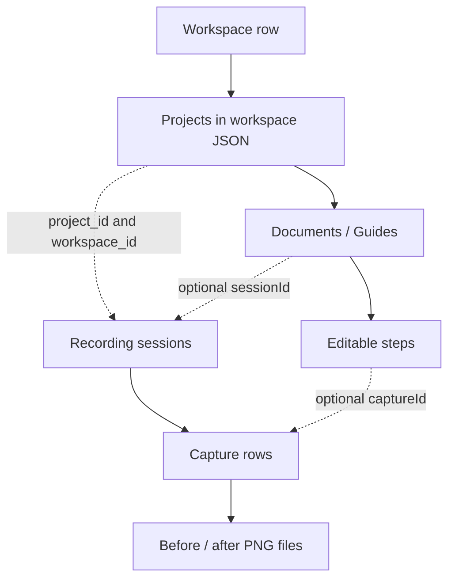

# Data model and retention

The schema and migrations live in [storage.cjs](../electron/storage.cjs); payload validation lives in [contracts.cjs](../electron/contracts.cjs). This guide explains relationships and invariants rather than duplicating every SQL column.

## Editable documents and source evidence

The diagram shows logical relationships. Only `captures.session_id` is enforced as a SQL foreign key; project/document ownership is validated in application code.

| Stored entity                            | Purpose                                                                                                                                                                          |
| ---------------------------------------- | -------------------------------------------------------------------------------------------------------------------------------------------------------------------------------- |
| `workspaces`                             | Workspace ID/name plus a JSON array of projects in `data`. `NULL` data allows initialization; `[]` is an initialized empty workspace.                                            |
| Project JSON                             | Name, description, documentation instructions and `documents`. Project IDs are unique within a workspace.                                                                        |
| Document (`Guide`) JSON                  | Editable title, description and steps. A real recording normally has `sessionId`; sample documents use `demo` and may have no session. Document IDs are unique within a project. |
| Step JSON                                | Editable instructions, screen label and optional capture reference/timing. Removing a step changes only the document.                                                            |
| `sessions`                               | Original task/context, project/workspace ownership, instructions at start, selected display, start time, status and error.                                                       |
| `captures`                               | UUID, session ID, sequence, click/frame metadata, image filenames and error. `(session_id, sequence)` is unique.                                                                 |
| `settings`                               | The active workspace ID, restored on launch.                                                                                                                                     |
| `deleted_projects`, `deleted_recordings` | Tombstones that prevent delayed document saves from recreating deleted content. Recording tombstones include document ID and optional session ID.                                |
| `pending_file_deletions`                 | Exact image filenames to unlink after committing a deletion. Failed unlinks are retried during later cleanup, including launch.                                                  |

Session and capture IDs are UUIDs. Source capture metadata includes normalized click coordinates, mouse button, click timestamp, selected display, and available frame dimensions/timestamps. PNGs are stored outside SQLite as `captures/<capture-id>-before.png` and `-after.png`; frames may be absent.

## Ownership and saves

- Every queued renderer save carries its workspace ID. Changing the active workspace must not redirect older edits to another workspace.
- `useWorkspace.mutate` flushes pending edits before switching, renaming or deleting. The main-process IPC guards require an idle recorder for workspace mutations and project/recording deletion.
- `saveWorkspace` validates the input and removes tombstoned projects/documents before validating capture references. Each referenced capture must belong to that document's session, project and workspace.
- `mergeSessions` adds completed/interrupted sessions missing from document JSON. Existing documents are retained, so edited instructions and removed steps survive reload. Merely filtering a recording out of renderer JSON is insufficient to delete it: its session would be merged back.
- Deleting a workspace removes its row. Subsequent saves to that ID fail `requireWorkspace`; they cannot recreate it. New workspaces receive fresh IDs.

## What deletion means

| Action           | Editable data                                                                          | Original evidence                                                                                    | Other effects                                                                             |
| ---------------- | -------------------------------------------------------------------------------------- | ---------------------------------------------------------------------------------------------------- | ----------------------------------------------------------------------------------------- |
| Remove step      | Removes one step; in-memory Undo can restore it                                        | Retained                                                                                             | Export omits the removed step                                                             |
| Delete recording | Removes its document and any documents referencing the same session within the project | Deletes session/capture rows; queues all their original frames, even those omitted from edited steps | Recording tombstones reject stale saves                                                   |
| Delete project   | Removes the project and its documents                                                  | Deletes all project sessions/captures; queues their frames                                           | Project tombstone rejects stale saves                                                     |
| Delete workspace | Removes the workspace, all projects/documents and its tombstones                       | Deletes all workspace sessions/captures; queues their frames                                         | Active workspace switches to the first remaining workspace; deleting the last is rejected |

Exports are separate user-owned copies and are never included in these deletions. Deletion unlinks known files; it does not promise secure erasure from storage media, backups or external copies. Unreferenced files left by a crash are retained for recovery, not swept up by a broad directory delete.

Deletion commits database changes and the file-cleanup queue in one transaction. A rollback restores both. File cleanup runs afterward because SQLite and the filesystem cannot share that transaction. The UI reports pending cleanup when files remain locked.

## Crash recovery and image writes

`saveFrame` writes an exclusive temporary file, flushes it, closes it and renames it before updating the capture row. A crash before the row update can leave an unreferenced PNG or temporary file; do not assume a file is safe to remove merely because it is not referenced.

Opening `Storage` is a mutating operation: it migrates the database and marks unfinished sessions as interrupted. Captures with neither frame nor an existing error receive an incomplete-screenshot error. Recovered documents contain the evidence actually saved, not invented frames.

For read-only diagnostics, use a read-only database connection instead of constructing `Storage`. Do not run tests against the normal user-data directory.

## Schema history and location

| Version | Migration                                                                                                                                    |
| ------- | -------------------------------------------------------------------------------------------------------------------------------------------- |
| 1       | Initial single workspace, sessions and captures                                                                                              |
| 2       | Workspace catalog, active selection, session workspace ownership, project tombstones and file-deletion queue; legacy data becomes `personal` |
| 3       | Recording tombstones                                                                                                                         |

Workspace rename/deletion uses existing tables and required no further schema change. Future schema changes must add a new transactional migration and migration tests; do not rewrite an earlier migration. A database newer than the supported version blocks startup.

Production data lives in `%APPDATA%\captura-desk`, with screenshots in its `captures` subfolder. Older data directories are not migrated or deleted; the new directory starts fresh on first launch. `CAPTURADESK_TEST_DATA` selects an isolated test directory. Browser preview uses localStorage through `use-workspace.ts` and does not provide native recording or SQLite durability. The prototype import key is `capturadesk-desktop-v1`; older browser keys are not imported.

See [storage tests](../tests/storage.test.cjs) for migration, stale-save rejection, deletion isolation, rollback and restart coverage.

## AI storage (schema version 4)

The v3-to-v4 transaction adds `ai_credentials` (provider and OS-encrypted API key), `ai_workspace` (workspace provider/model default), and `ai_drafts` (source document snapshot, validated output, capture session, provider/model, timestamp and prompt version). No plaintext key is stored in workspace JSON or returned by the preload bridge.

Workspace defaults cascade with workspace deletion. Drafts reference both workspace and recording session with SQL cascading deletes, so workspace/project/recording deletion removes the corresponding drafts. Credentials are device-wide and remain until explicitly removed in AI providers. Removing a key does not delete existing documents or drafts.

AI output is kept separate until the user saves it as a new document. Saving verifies the source snapshot still matches, preserves its original document, and copies the selected step/capture references into a new guide. These documents share source evidence; deleting the recording removes all documents referring to that session. See [AI integration](ai.md).

## Deleting a revision

`document:delete` removes only a derived document (`id !== sessionId`). It rejects original recordings, which use `recording:delete`. The storage transaction removes drafts sourced from the deleted revision and adds a `deleted_recordings` tombstone with a null session ID, preventing delayed workspace saves from restoring it without filtering sibling documents. Session rows and image files remain shared and untouched.

Revision metadata lives on document JSON: `revision` (0 for the original), `revisionLabel`, `createdAt`, and `basedOnRevision`. Durable `settings` keys named `revision_counter:<sessionId>` retain the highest allocated number, including deleted revisions. Allocation occurs when a draft is saved as a document; a failed save may leave a numbering gap. Legacy revisions are labeled on load in stored order without inventing dates or lineage. AI draft output JSON also retains the requested label so a saved draft can be applied after restart. Document exports remain independent of revision metadata.

Screenshot annotations are stored in each capture metadata object as `annotations.before` and `annotations.after`: up to 100 normalized rectangles with kind `highlight` or `redact`. They are shared across documents referencing the capture. `capture:annotation-save` validates bounds and requires an idle recorder and AI service. Originals remain immutable; `Storage.image` flattens edits through the Electron bitmap compositor for display, AI, and export. Rendering failures block image delivery rather than falling back to originals. Only the annotation editor requests original pixels explicitly.

Capture metadata may include `application`, a friendly process name or executable basename identified from the clicked window. It is optional and used when materializing new document steps and preparing AI capture context. Lookup failures retain the display-name fallback. Existing document titles are not rewritten. No executable paths or window titles are persisted.

Manual captures use `trigger: "manual"`, null `point` and `button`, and one fresh screenshot in the `before` slot for compatibility with existing storage. The viewer and export label it as a screenshot, and AI receives the trigger to avoid inferring a click. Pause/stop invalidates pending manual frames; an accepted capture canceled before saving retains an error record.

## Workspace backup format

`electron/backup.cjs` implements version 1 of the `captura-desk-workspace` JSON format (`.captura-backup`). It embeds original PNGs as base64 with SHA-256 checksums and explicitly selects workspace-scoped data, excluding device credentials. Limits are 128 MiB of source images and 256 MiB per file. Restore validates identifiers, relationships, annotation bounds, draft shape and image checksums, then allocates fresh workspace/session/capture/draft IDs. Project and document IDs remain workspace-scoped. Revision counters survive deletions. Draft source and output references are remapped so saved drafts remain usable.

Restore inserts metadata in a SQLite transaction and writes uniquely named images with exclusive creation. Errors roll back database rows and remove newly written images. A process crash before commit may leave unreferenced images, consistent with existing capture recovery behavior. Backup export writes and syncs a temporary file before renaming it. IPC excludes concurrent operations during transfer, and the renderer flushes pending workspace edits first. Keys, deletion tombstones, and exported files outside the app are not included.

Prompt-shaped documents use optional `format: "document"`. Sections remain in the `steps` array for editor compatibility, with a primary `captureId` plus optional `captureIds` holding all cited evidence. Section IDs are independent UUIDs. Storage validates all references against the source session. Exports include all sources; backup restore remaps primary and additional capture IDs in documents and draft output/source snapshots. Older documents without `captureIds` continue to use their single primary source.
